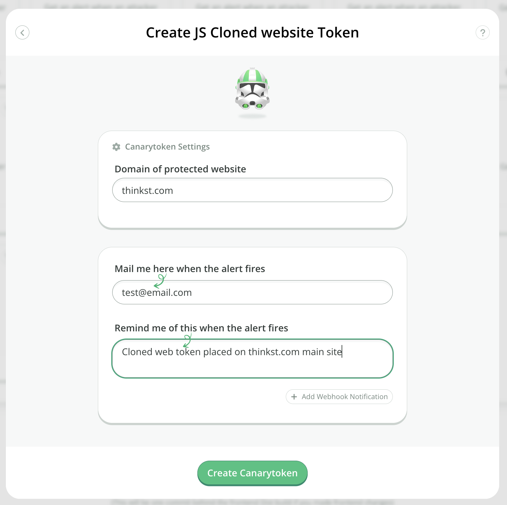
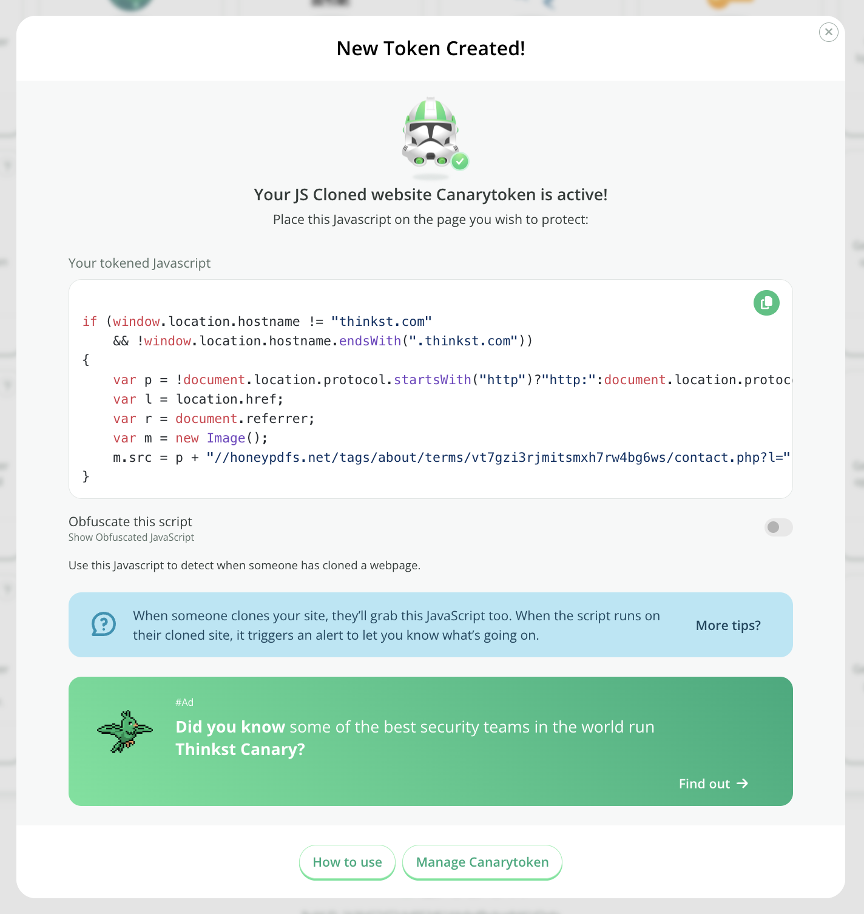

# Cloned Website Token

## What is a Cloned Website Token

This Canarytoken is placed within the JavaScript of your websites and notifies you if someone clones your site and hosts it on another domain. (This is often used for targeted Phishing attacks.)

## Creating a Cloned Website token

Head on over to [canarytokens.org](https://canarytokens.org/generate) and select `Cloned Website`:

Enter your email address along with a reminder that will be easy to understand. Also supply the domain that your token will live at then click Create:

Copy the javascript (optionally run through an obfuscator) onto the pages of the website deployed at the specified domain.
