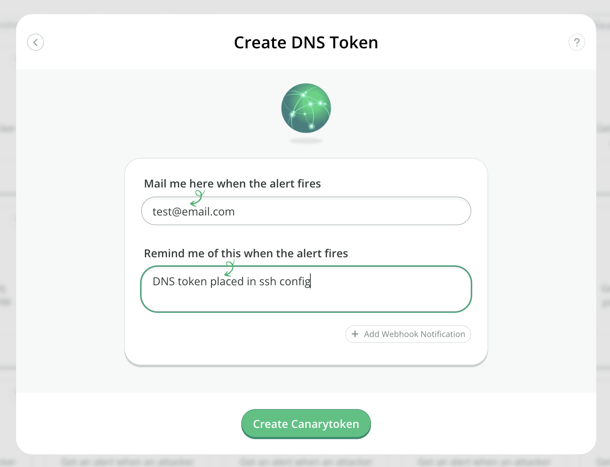
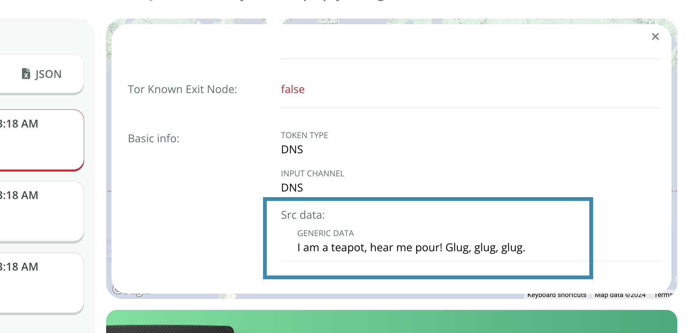

# DNS Token

## What is a DNS token

When you create a DNS based Canarytoken, the system gives you a unique Internet resolvable domain name.

Anyone attempting to resolve this domain name, will now trigger an alert.

Why does this matter? Once you are able to get an alert for a web-based token, or a DNS based token, you have the building blocks for squillions of possible tripwires.

## Creating a DNS token

Head on over to [canarytokens.org](https://canarytokens.org/generate) and select `DNS token`:



Enter your email address along with a reminder that will be easy to understand then click Create:


Copy the hostname and place it somewhere useful.

## Encoding additional information in your token

Your DNS token can carry a small amount of additional custom data when it’s triggered. This can be used for adding incident-specific data to your alert with custom DNS based tokens. Use the following encoding rules to place generic data into your DNS token:

 * Base32 encode your data, and remove any padding '=' characters
 * Insert periods (.) after every 63-bytes
 * Append the magic string '.G'+<2-random-digits>+'.' (e.g. '.G12.' or '.G83.')
 * Append your DNS token
This creates a new hostname of the form:
```
  <base32-string>.<base32-string>.G<2-random-digits>.<dns-token>
```
Bear in mind the total length of the hostname still cannot exceed 253-bytes, so the amount of raw bytes that can be encoded is ~125.

### Example code

Here's a Python example of the encoding rules:
```
>>> token='pz21qtyfsidipvrsuzs9n2udi.canarytokens.com'
>>> data='I am a teapot, hear me pour! Glug, glug, glug.'
>>> import base64, re, random
>>> '.'.join(filter(lambda x: x,re.split(r'(.{63})', base64.b32encode(data.encode('utf8')).decode('utf8').replace('=','')) + ['G'+str(random.randint(10,99)), token]))
'JEQGC3JAMEQHIZLBOBXXILBANBSWC4RANVSSA4DPOVZCCICHNR2WOLBAM5WHKZZ.MEBTWY5LHFY.G72.pz21qtyfsidipvrsuzs9n2udi.canarytokens.com'
```

### Reading the transmitted data

The decoded data is shown the incident's history:


