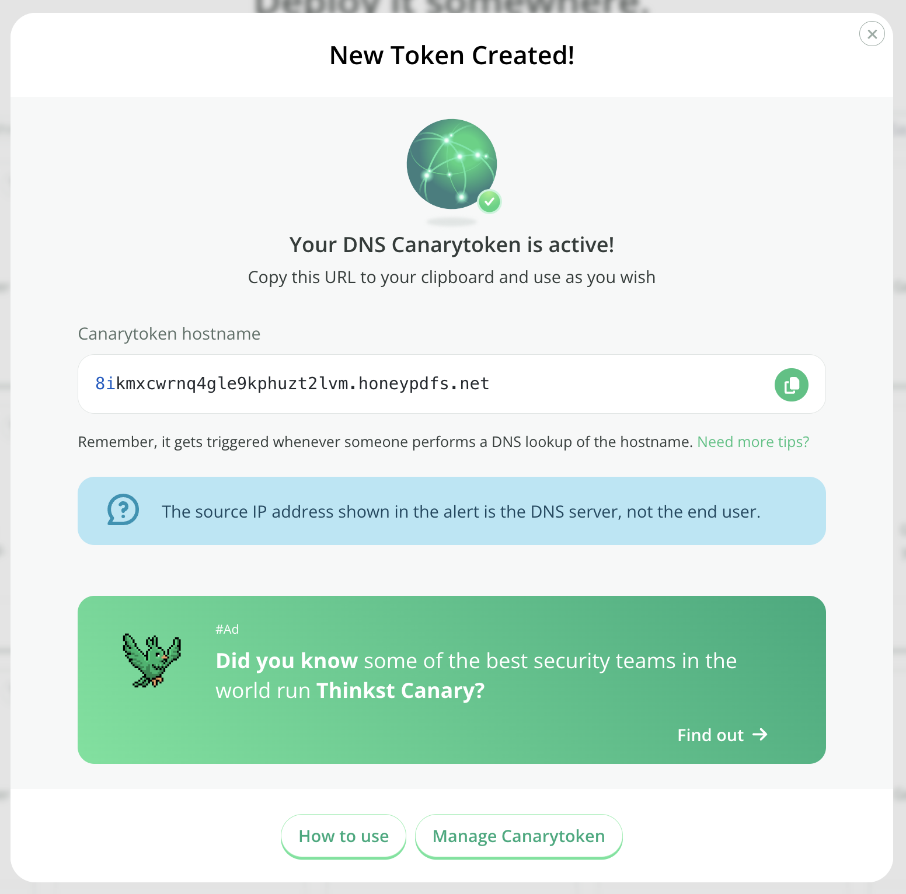

# DNS Token

## What is a DNS token

When you create a DNS based Canarytoken, the system gives you a unique Internet resolvable domain name.

Anyone attempting to resolve this domain name, will now trigger an alert.

Why does this matter? Once you are able to get an alert for a web based token, or a DNS based token, you have the building blocks for squillions of possible tripwires.

## Creating a DNS token

Head on over to [canarytokens.org](https://canarytokens.org/generate) and select `DNS token`:

Enter your email address along with a reminder that will be easy to understand then click Create:

Copy the hostname and place it somewhere useful.
