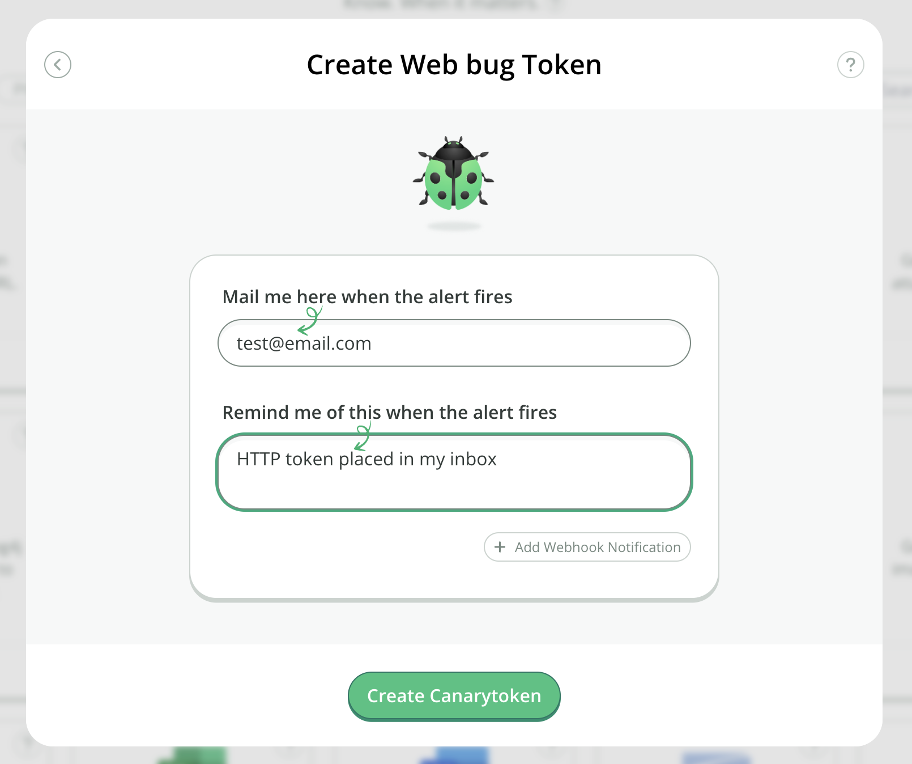

# Getting Started

## How Canarytokens work (in 3 short steps)

Go to [canarytokens.org](https://canarytokens.org/generate) and select your Canarytoken (supply an email to be notified at as well as a memo that reminds you which Canarytoken this is and where you put it).



Place the generated Canarytoken somewhere special (read the [examples](./examples.md) for ideas on where).

If an attacker ever trips on the Canarytoken somehow, you'll get an email letting you know that it has happened.

## How do attackers trip over a Canarytoken

Recall that a typical Canarytoken is a unique URL and/or hostname. The URL component is pretty flexible. This means that if your Canarytoken is:

```bash
http://45e51129ec7e.o3n.io/images/o63277vnjf6nfobn3cbey69fh/spacer.gif
```

then someone visiting any of these:

```bash
http://45e51129ec7e.o3n.io/images/o63277vnjf6nfobn3cbey69fh/admin.asp
http://45e51129ec7e.o3n.io/images/o63277vnjf6nfobn3cbey69fh/secrets.docx
http://45e51129ec7e.o3n.io/images/o63277vnjf6nfobn3cbey69fh/passwords.zip
http://45e51129ec7e.o3n.io/images/o63277vnjf6nfobn3cbey69fh/anything-really
```

would still activate your Canarytoken. This gives us the simplest use-case for a Canarytoken, an old fashioned web-bug.

For example, you could send yourself an email with a link to the Canarytoken plus some lure text:


Simply keep it in your inbox unread since you know not to touch it. An attacker who has grabbed your mail-spool doesn't. So if your emails are stolen, then an attacker reading them should be attracted to the mail and visit the link – and while your week is about to get worse, at least you know.

If you like, you could even use the same Canarytoken as an embedded image. This way it works like the classic 1x1 transparent GIF. Now an attacker reading your inbox could trip over it just because his mail client renders remote images. (In this way you can use free Canarytokens as a classic web/mail-bug, to receive a notification when an email you send has been read.)

## What memo should I use

Over time, if you are using Canarytokens correctly, you will deploy thousands of them all over the place. Make sure that your Reminder is descriptive, and will be self-describing. Nothing sucks more than having a Canarytoken fire an alert that reads “test" - and not knowing where you placed it.

## Production Usage

Canarytokens can be used as simple web-bugs, but they are incredibly flexible as we'll see.

You may have a fancy SIEM that lets you know when stuff happens, but you'll find that with a little creativity, there's a bunch of places that you could get wins from a Canarytoken (that can be deployed in seconds) that you couldn't easily get to otherwise.

Do you trust the admins/support at Dropbox to leave your files alone? (or Office365?) Simply generate a Canarytoken and drop it in your folder, or mention it in your HipChat channel. If some admin is browsing contents in their spare time (or is being coerced to do so by a 3rd party) they will trip over your URL and you'll be notified.
