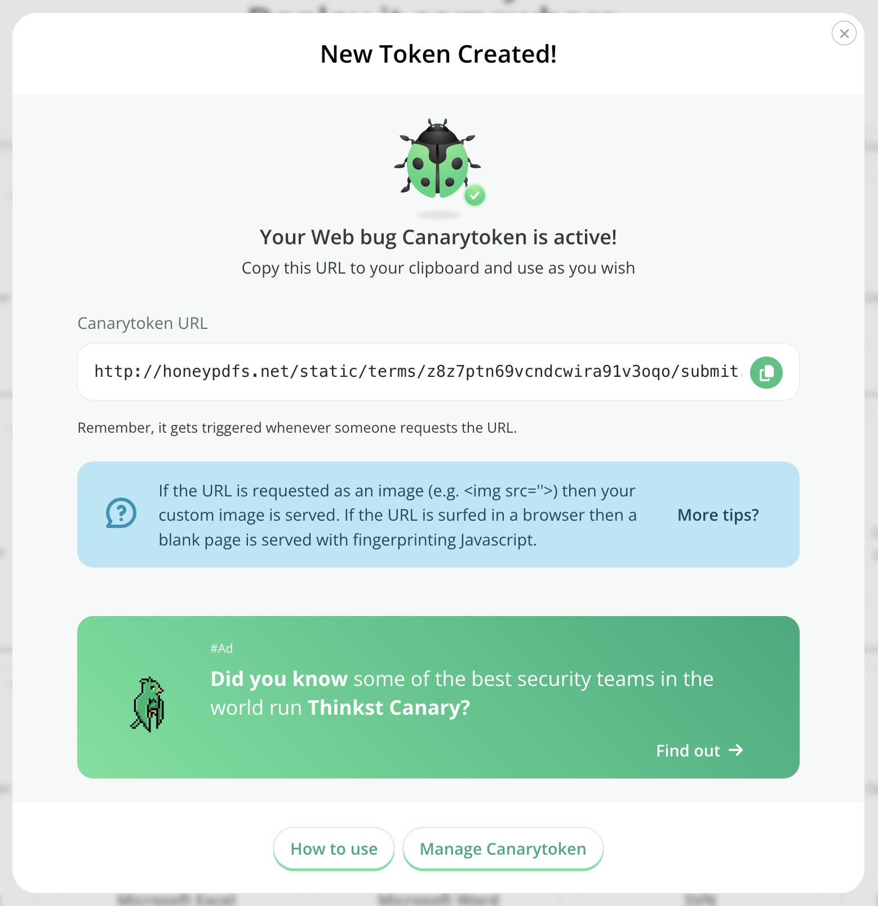

# HTTP Canarytoken

## What is an HTTP Canarytoken

When you create a HTTP based Canarytoken, the system gives you a URL.

Anyone attempting to browse to this URL will generate an alert.

Why does this matter? Once you are able to get an alert for a web-based Canarytoken, or a DNS based Canarytoken, you have the building blocks for squillions of possible tripwires.

## Creating an HTTP Canarytoken

Head on over to [canarytokens.org](https://canarytokens.org/generate) and select `Web bug`:

Enter your email address along with a reminder that will be easy to understand then click Create:

Copy the URL and place it somewhere useful.
