# Fake IdP SAML App Canarytoken

## What is an IdP SAML2 App Canarytoken

Detect identity compromise with the IdP App Canarytoken. It works simply: you setup a juicy sounding app in your SSO dashboard, and if the app is ever opened then you get an email with the identity of the user who clicked on the fake app. This lets you identify exactly which user was compromised.

Optionally it can redirect the user to a URL of your choice, after they've opened the app. This helps maintain the ruse for longer.

## Creating the Canarytoken

Create a Canarytoken by choosing 'IdP App' from the Canarytokens list.

If you want the app to redirect to a specific URL, enter it in the 'Redirect URL' box.

Leave a reasonable comment to remind yourself where you will deploy the Canarytoken (e.g. 'Fake Salesforce app on Okta').

Tap the 'Create Canarytoken' button. To fully impersonate a well-known app, select it from the dropdown and download its icon to use on your dashboard.

In your Identity Provider admin interface create a new SAML2 app, give it the name and icon of your choice, and use the SAML SSO login URL and entity ID provided to configure your token. The app can now be assigned to your users. We recommend training folks about which apps are tokened.

## Installing the Canarytoken

The specific instructions for how to add this token to your suite of SAML applications varies between IdP. Below are detailed instructions for both Microsoft Entra ID (formerly Azure AD) and Okta, two leading IdPs.

### Deploying to Azure

As a user in the Azure tenant with at least Enterprise Application Administrator permissions, navigate to the [Enterprise Applications](https://portal.azure.com/#view/Microsoft_AAD_IAM/StartboardApplicationsMenuBlade/~/AppAppsPreview/menuId~/null) panel in the Entra ID Azure Portal. 

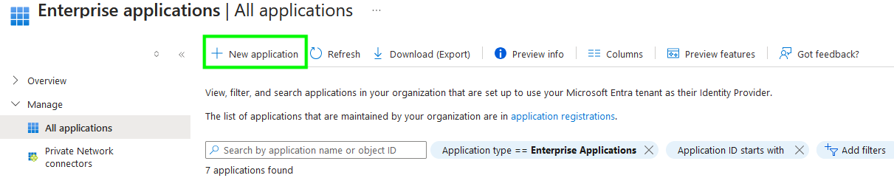

Select 'New Application', then 'Create a new application' and enter the name of the application as you'd like for it to appear, for example 'Salesforce'. Make sure to select that the application is a 'Non-gallery' application, then click 'Create'.

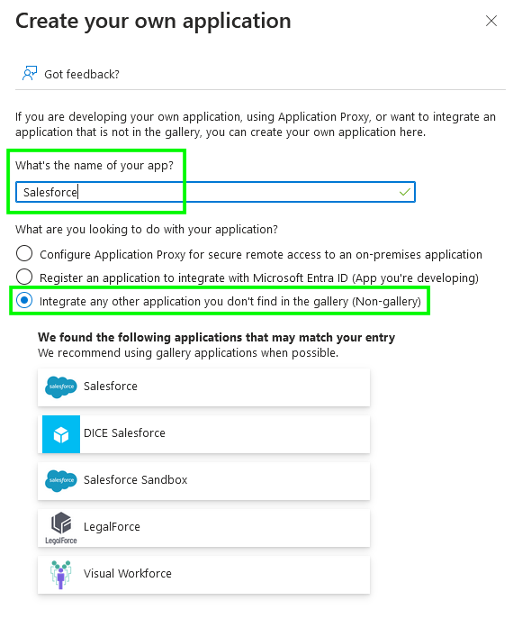

From the application Properties panel, upload the corresponding application icon, ensure that the application is enabled, that assignment is not required, and that it's visible to users. Save and move on to the Single sign-on panel.

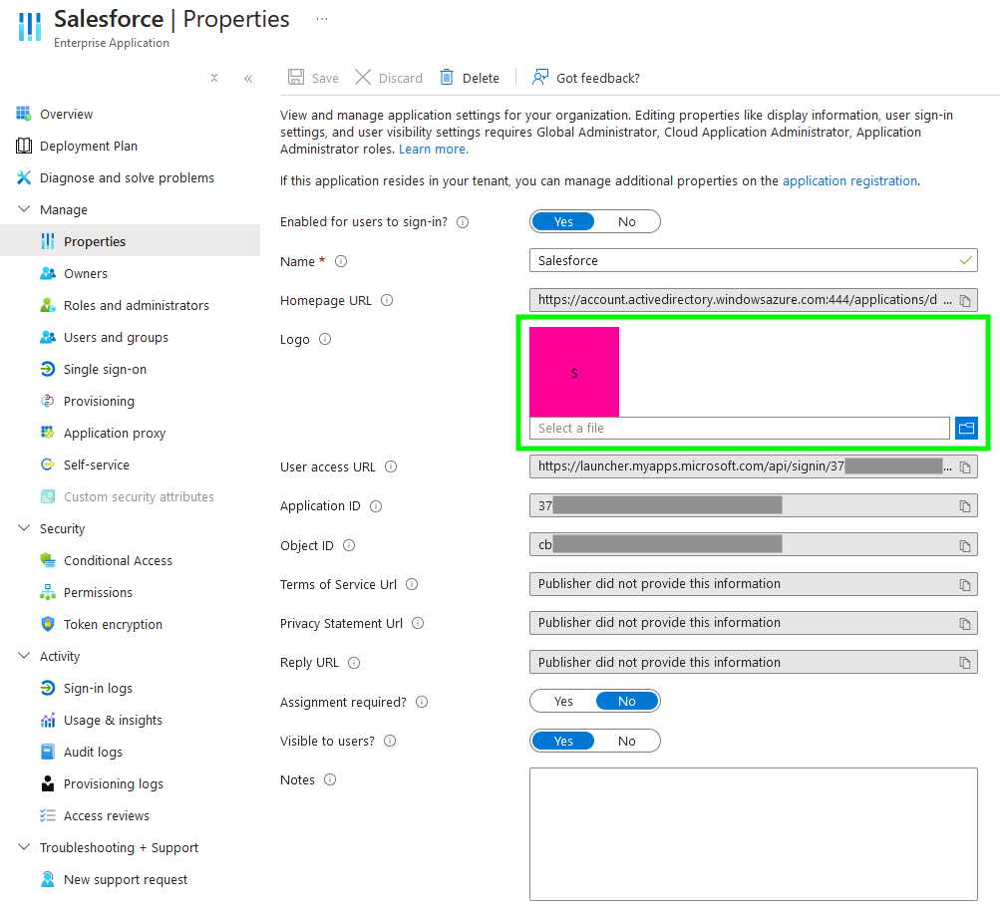

Select 'SAML' as the single sign-on method, and edit the 'Basic SAML Configuration'. 

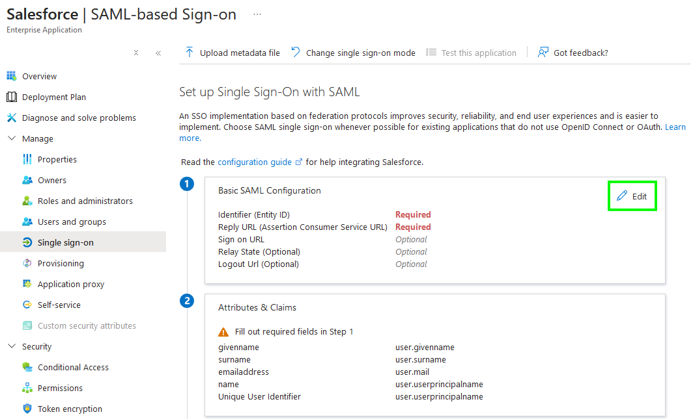

From the Canarytoken page, copy the 'Entity ID' to the form, and the 'ACS URL' to *both* the 'Reply URL' and 'Relay State' fields. Now click 'Save'. At the bottom of this page is a test button, which should open a new tab, redirect you to the token, and then to the redirect URL. You should also see an alert pop-up with your email address.

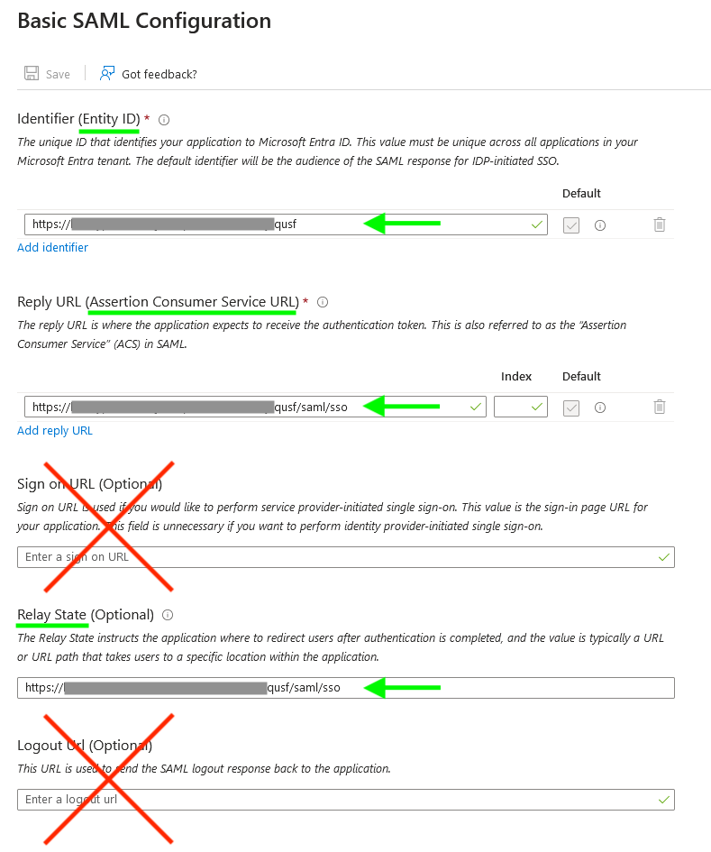

If you'd like for the token application to appear in the Microsoft 365 Apps list, assign users (or groups of users) to the application from the 'Users and groups' pane. Finally, the Self-service tab provides an option to allow users to request access to the application, and you can disable requiring approval—now all your users can add or find this application!

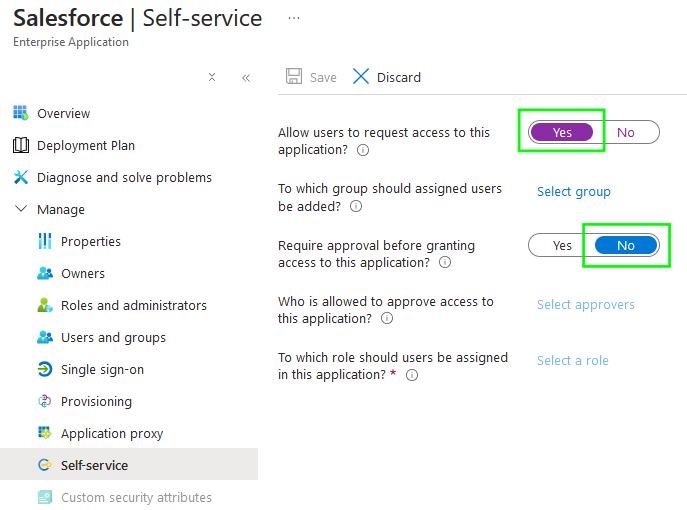

### Deploying to Okta
As an admin user in your Okta organisation, navigate to the Applications panel of your Admin interface. 

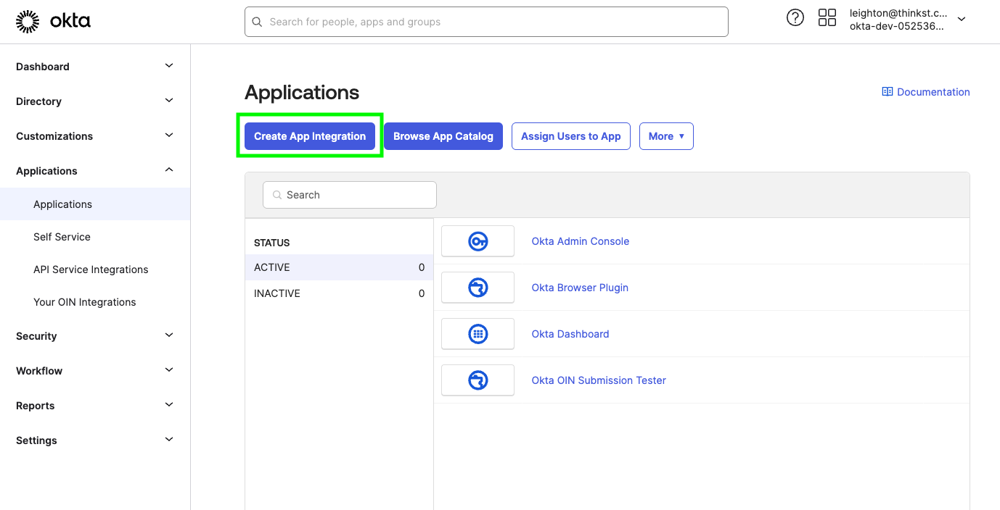

Click 'Create App Integration', select 'SAML 2.0', and click 'Next'. 

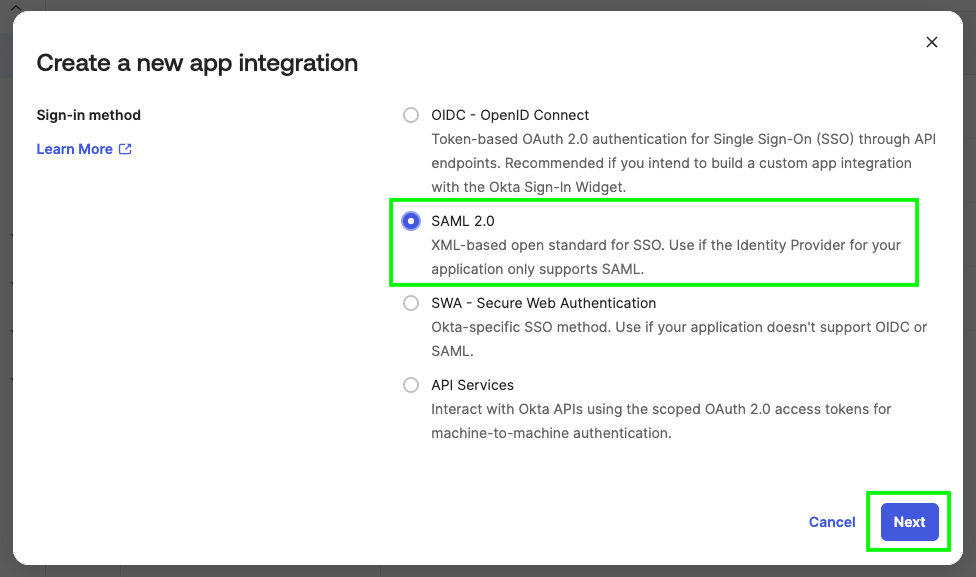

Enter the decoy name of the fake application, for example 'Salesforce', upload the corresponding app logo, and click 'Next'.

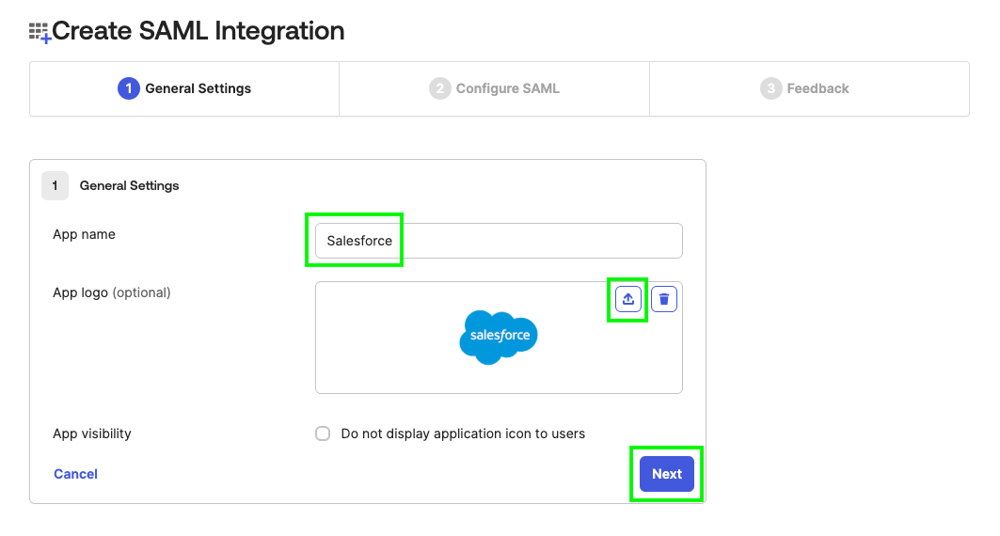

From the Canarytoken page, copy the 'ACS URL' and paste it in the 'Single sign-on URL' field. Then copy the 'Entity ID' and paste it in the 'Audience URI (SP Entity ID)' field. Scroll down and click 'Next', then click 'Finish'. 

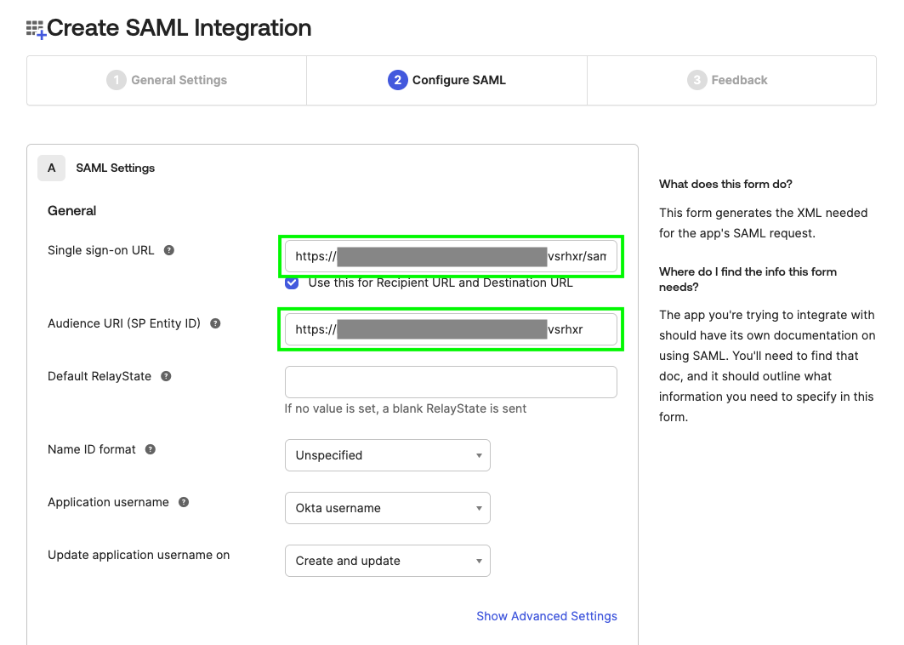

Assign users to the application by clicking the 'Assignments' tab, opening the 'Assign' dropdown, and selecting 'Assign to People' or 'Assign to Groups'. Finally, the Self-service tab provides an option to allow users to request access to the application, and you can disable requiring approval—now all your users can add or find this application!

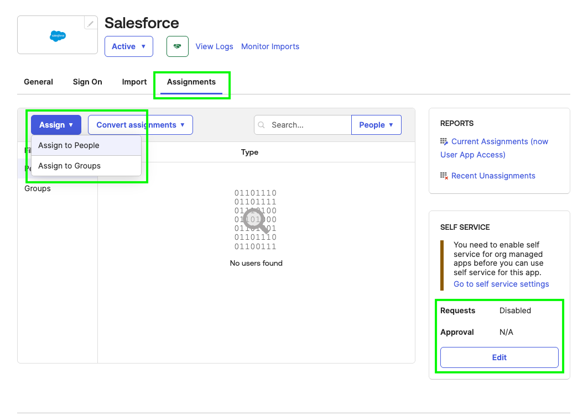
