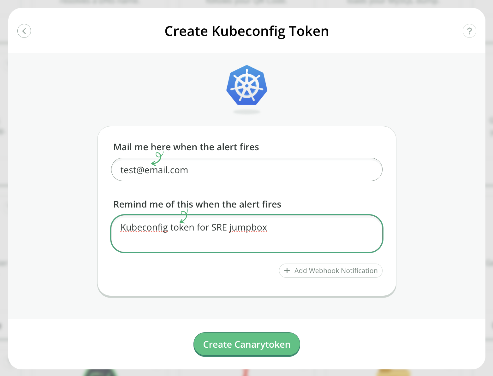
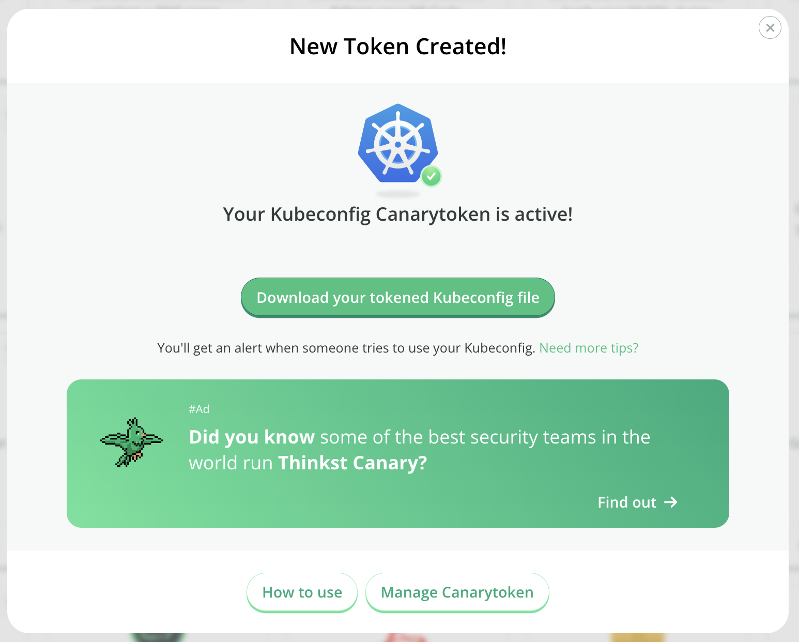

# Kubeconfig Token

## What is a Kubeconfig token?

A `kubeconfig` file is a YAML file that contains all information needed to authenticate to the control plane of a Kubernetes cluster. This includes the name of the cluster, the API Server endpoint and user credentials.

Our Kubeconfig Token is a `kubeconfig` file we generate that can be used just like any other `kubeconfig` file — it contains the API server endpoint that `kubectl` should connect to, as well as the credentials needed to authenticate to the API server that we host. These credentials are unique to your Canarytoken.

Using the Kubeconfig Canarytoken will simply return permission errors to an attacker and result in a neat, timely alert for you!

## Creating a Kubeconfig token

Head on over to [canarytokens.org](https://canarytokens.org/generate) and select `Kubeconfig`.

Enter the email address or webhook where you would like to get alerts. Next, enter a reminder note that will be convenient for you to identify where you placed the Kubeconfig, when you get alerted.

Create the token by clicking on `Create my Canarytoken`.


Download the tokened Kubeconfig file.


## Where can it be placed?

The downloaded file can then be placed in the default locations where `kubeconfig` files are expected like `~/.kube/`, or any location you think someone snooping around would look.

A Kubeconfig token can also be used as a secret in CI/CD platforms, as most modern platforms can and do interact with Kubernetes clusters to build and/or deploy artifacts produced by pipelines.

### Special use-case

When using the Kubeconfig token with CI/CD platforms, you might see some limitations. Some CI/CD platforms don't support secrets longer than 10000 characters, and require the secret to be encoded in base64.

A Kubeconfig token when converted to base64 typically has more than 10000 characters. In such a case, there's a way to make the kubeconfig (any `kubeconfig` file, not just our Canarytoken) compact by removing `clusters.cluster.certificate-authority-data` and replacing it with `clusters.cluster.insecure-skip-tls-verify: true`.

```
apiVersion: v1
kind: Config
clusters:
- cluster:
    insecure-skip-tls-verify: true
    server: https://xx.xx.xx.xx
  name: k8s-prod-cluster
```

This flag essentially asks `kubectl` to silently skip TLS verification and does not hinder the working of the Canarytoken. When converted to base64 now, it will contain less than 10000 characters and will still alert you when used.
